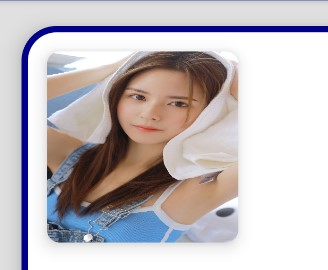

# BackgroudLibrary
A framework for directly generating shape through Tags, no need to write shape.xml again（通过标签直接生成shape，无需再写shape.xml）  

依赖方式：

    implementation 'com.noober.background:core:1.4.0'

## 示例效果

裁剪,与阴影效果

 

通过配置Live Templates，实现自动代码提示  

## 使用方法
1、在BaseActivity中的super.onCreate之前调用。**如果minSdkVersion < 16:bl_gradient_angle, bl_gradient_startColor, bl_gradient_centerColor, bl_gradient_endColor会失效，其他正常**
    
    BackgroundLibrary.inject(context);

2、在layout中直接添加属性即可。

[博文使用介绍](https://github.com/JavaNoober/BackgroundLibrary/blob/master/%E4%BD%BF%E7%94%A8%E4%BB%8B%E7%BB%8D.md)

## 基础用法
下面是所有的自定义属性，使用方法和shape、selector完全一样
### shape类
支持shape的所有属性，命名规则就是**标签名_标签属性名**：

| 名称 | 类型 |
|---|---|
|bl_shape|rectangle、oval、line、ring(暂时不支持)|
|bl_solid_color|color|
|bl_corners_radius|dimension|
|bl_corners_bottomLeftRadius|dimension|
|bl_corners_bottomRightRadius|dimension|
|bl_corners_topLeftRadius|dimension|
|bl_corners_topRightRadius|dimension|
|bl_gradient_angle|integer|
|bl_gradient_centerX|float|
|bl_gradient_centerY|float|
|bl_gradient_centerColor|color|
|bl_gradient_endColor|color|
|bl_gradient_startColor|color|
|bl_gradient_gradientRadius|dimension|
|bl_gradient_type|linear、radial、sweep|
|bl_gradient_useLevel|boolean|
|bl_size_width|dimension|
|bl_size_height|dimension|
|bl_stroke_width|dimension|
|bl_stroke_color|color|
|bl_stroke_dashWidth|dimension|
|bl_stroke_dashGap|dimension|
|bl_position|left、right、top、bottom|

### 其他属性
| 名称 | 类型 |备注|
|---|---|---|
| bl_isClip | boolean | 1.**按形状裁剪控件 ** 可无solid,stroke等颜色 圆形裁剪`app:bl_shape="oval"` 圆角裁剪`app:bl_corners_radius="10dp"`, 不支持上下左右不同数值的圆角. 2.**生成阴影**,使用原生`android:elevation="4dp"`等产生,圆角,圆形,或方形阴影 同样可以对图片做阴影 |
|bl_stroke_color| color| 边框颜色 |
|bl_ripple_color|color|水波纹颜色，有值则开启点击时水波扩展的效果|
|bl_stroke_color_checked| color| 状态颜色，必须配合一个无状态的颜色bl_stroke_color才有效果 |
|bl_stroke_color_selected| color| |
|bl_stroke_color_pressed| color| |
|bl_stroke_color_focused| color| |
|bl_stroke_color_unEnabled| color| |
|bl_solid_color| color| 填充色 |
|bl_solid_color_checked| color| 状态颜色，必须配合一个无状态的颜色bl_solid_color才有效果 |
|bl_solid_color_selected| color| |
|bl_solid_color_pressed| color| |
|bl_solid_color_focused| color| |
|bl_solid_color_unEnabled| color| |

注意:
### 关于text颜色的设置
| 名称 | 类型 |备注|
|---|---|---|
|android:textColor|color|原生文字颜色,无状态颜色|
|bl_textColor_checked|color||
|bl_textColor_selected|color||
|bl_textColor_pressed|color||
|bl_textColor_focused|color||
|bl_textColor_unEnabled|color||

注意:文字状态颜色，必须配合一个textColor才有效

### selector类

支持selector的所有属性：

| 名称 | 类型 |
|---|---|
|bl_checkable_drawable|color、reference|
|bl_checked_drawable|color、reference|
|bl_enabled_drawable|color、reference|
|bl_selected_drawable|color、reference|
|bl_pressed_drawable|color、reference|
|bl_focused_drawable|color、reference|
|bl_focused_hovered|color、reference|
|bl_focused_activated|color、reference|
|bl_unCheckable_drawable|color、reference|
|bl_unChecked_drawable|color、reference|
|bl_unEnabled_drawable|color、reference|
|bl_unSelected_drawable|color、reference|
|bl_unPressed_drawable|color、reference|
|bl_unFocused_drawable|color、reference|
|bl_unFocused_hovered|color、reference|
|bl_unFocused_activated|color、reference|
|关于checkbox、radiobutton的buttonDrawable的设置||
|bl_checked_button_drawable|color、reference|
|bl_unChecked_button_drawable|color、reference|

### 代码生成Drawable的Api,详情见DrawableCreator类

所有的属性都提供了**set方法**去通过代码设置，具体见[DrawableCreator.Build](https://github.com/JavaNoober/BackgroundLibrary/blob/develop/library/src/main/java/com/noober/background/drawable/DrawableCreator.java)
使用方法如下：

    //设置button圆角背景
    Drawable drawable = new DrawableCreator.Builder().setCornersRadius(dip2px(20))
                    .setGradientAngle(0).setGradientColor(Color.parseColor("#63B8FF"), Color.parseColor("#4F94CD")).build();
    btn.setBackground(drawable);
    //文字点击变色
    tvTest1.setClickable(true);//由于Android源码的原因，必须调用，否则不生效
    ColorStateList colors = new DrawableCreator.Builder().setPressedTextColor(Color.RED).setUnPressedTextColor(Color.BLUE).buildTextColor();
    tvTest1.setTextColor(colors);

## 使用例子

1.边框+背景+圆角

    <TextView
        android:layout_width="130dp"
        android:layout_width="130dp"
        android:layout_height="36dp"
        android:gravity="center"
        android:text="TextView"
        android:textColor="#8c6822"
        android:textSize="20sp"
        app:bl_corners_radius="4dp"
        app:bl_solid_color="#E3B666"
        app:bl_stroke_color="#8c6822"
        app:bl_stroke_width="2dp" />
等同于

    <shape xmlns:android="http://schemas.android.com/apk/res/android">
        <corners android:radius="2dp"/>
        <solid android:color="#E3B666"/>
        <stroke android:color="#E3B666" android:width="2dp"/>
    </shape>

2、渐变

    <shape xmlns:android="http://schemas.android.com/apk/res/android">
        <corners android:radius="2dp"/>
        <gradient android:angle="0" 
                  android:startColor="#63B8FF"
                  android:endColor="#4F94CD"/>
    </shape>

等同于

     <Button
        android:id="@+id/btn"
        android:layout_width="130dp"
        android:layout_height="36dp"
        android:layout_marginTop="5dp"
        android:gravity="center"
        android:padding="0dp"
        android:text="跳转到列表"
        android:textColor="#4F94CD"
        android:textSize="20sp"
        app:bl_corners_radius="2dp"
        app:bl_gradient_angle="0"
        app:bl_gradient_endColor="#4F94CD"
        app:bl_gradient_startColor="#63B8FF" />

点击效果

第一个点赞效果：

    android:layout_width="20dp"
    android:layout_height="20dp"
    android:layout_marginTop="5dp"
    app:bl_pressed_drawable="@drawable/circle_like_pressed"
    app:bl_unPressed_drawable="@drawable/circle_like_normal" />

就等同于:  

    <selector xmlns:android="http://schemas.android.com/apk/res/android">
        <item android:state_pressed="true"
            android:drawable="@drawable/circle_like_pressed" />
        <item android:state_pressed="false"
            android:drawable="@drawable/circle_like_normal" />
    </selector>

通过代码设置：

    Drawable drawable4 = new DrawableCreator.Builder().setCornersRadius(dip2px(20))
            .setPressedDrawable(ContextCompat.getDrawable(this, R.drawable.circle_like_pressed))
            .setUnPressedDrawable(ContextCompat.getDrawable(this, R.drawable.circle_like_normal))
            .build();
    tv.setClickable(true);
    tv.setBackground(drawable4);   

第二个按钮效果：

    <Button
            android:layout_width="300dp"
            android:layout_height="50dp"
            android:layout_marginTop="5dp"
            android:gravity="center"
            android:padding="0dp"
            android:text="有波纹触摸反馈的按钮"
            android:textColor="@android:color/white"
            android:textSize="20sp"
            app:bl_corners_radius="20dp"
            app:bl_pressed_drawable="#71C671"
            app:bl_ripple_color="#71C671"
            app:bl_ripple_enable="true"
            app:bl_stroke_color="#8c6822"
            app:bl_stroke_width="2dp"
            app:bl_unPressed_drawable="#7CFC00" />

通过代码设置：

    Drawable drawable3 = new DrawableCreator.Builder().setCornersRadius(dip2px(20))
            .setRipple(true, Color.parseColor("#71C671"))
            .setSolidColor(Color.parseColor("#7CFC00"))
            .setStrokeColor(Color.parseColor("#8c6822"))
            .setStrokeWidth(dip2px(2))
            .build();
    btn.setBackground(drawable3);

使用其实基本和selector shape一样。

3.点击文字变色
  

    <Button
        android:layout_width="300dp"
        android:layout_height="50dp"
        android:layout_marginTop="5dp"
        android:gravity="center"
        android:padding="0dp"
        android:text="点击文字变色"
        android:textColor="@android:color/holo_red_dark"
        app:bl_textColor_pressed="#919DAF"/>

4.点击填充边框变色属性

    <TextView
        android:layout_width="180dp"
        android:layout_height="36dp"
        android:layout_marginTop="15dp"
        android:gravity="center"
        android:text="点击边框变色"
        android:textColor="@android:color/black"
        android:textSize="18dp"
        android:textStyle="bold"
        android:clickable="true"
        app:bl_solid_color_pressed="#FFDEAD"
        app:bl_solid_color_unPressed="#E9967A"
        app:bl_stroke_width="1dp"
        app:bl_stroke_color_pressed="#C6E2FF"
        app:bl_stroke_color="#98FB98"/>

5.style类似的使用方式

style中不要加入"app:", 直接写属性名即可

    
    
    <TextView
        android:layout_width="130dp"
        android:layout_height="36dp"
        android:gravity="center"
        android:text="TextView"
        android:textColor="#8c6822"
        android:textSize="20sp"
        style="@style/bg"/>

6.设置drawableLeft

        <Button
            android:id="@+id/btn_like"
            android:layout_width="wrap_content"
            android:layout_height="wrap_content"
            android:layout_marginTop="5dp"
            app:bl_position="left"
            android:background="@null"
            android:text="点赞+1"
            app:bl_pressed_drawable="@drawable/circle_like_pressed"
            app:bl_unPressed_drawable="@drawable/circle_like_normal" />
    
        <Button
            android:id="@+id/btn_like2"
            android:layout_width="wrap_content"
            android:layout_height="wrap_content"
            android:layout_marginTop="5dp"
            app:bl_position="left"
            android:background="@null"
            android:text="未点赞"
            app:bl_textColor_selected="#fbdc4a"
            app:bl_textColor_unSelected="@android:color/black"
            app:bl_selected_drawable="@drawable/circle_like_pressed"
            app:bl_unSelected_drawable="@drawable/circle_like_normal" />

## 简单的性能测试
图片无法加载

## 如何预览  

  

1、如果需要对View进行预览，直接把原来的View换成框架内对应的BLView即可，即可展示预览效果，如果不需要预览可以直接忽略这些用于预览的自定义View；  
2、如果没有效果，make project一下即可；  
3、如果BLView中没有对应的需要预览的View，可以很简单的自己实现一下，以BLTextView为例：

    public class BLTextView extends AppCompatTextView {

​        public BLTextView(Context context, AttributeSet attrs) {
​            super(context, attrs);
​            init(context, attrs);
​        }
​    
​        private void init(Context context, AttributeSet attrs){
​            BackgroundPreview.setViewBackground(context, attrs, this);
​        }
​    }

继承所需要预览的View，然后在构造函数中添加BackgroundFactory.setViewBackground(context, attrs, this)方法即可。    

​    

​    

## 使用注意
1、selector的相关属性，如果传入的drawable不是颜色的资源，会覆盖掉shape设置的属性  
2、在根布局添加
    

        tools:ignore="MissingPrefix"
  可以防止报红  
3、因为layoutInflater限制了只能有一个factory，如果有其他库已经使用了setFactory方法，比如换肤的库，只需要在其他库调用layoutInflater.setFactory之后调用

    BackgroundLibrary.inject2(context);

这样其他的库与本库同样可以生效。  
4、selector一个item表示多个属性，暂时无法实现，如下：

     <item android:state_pressed="true" android:state_focused="true"
        android:drawable="@drawable/button_pressed" />

因为无法用一个属性去表示两种状态，有思路的同学可以告诉我  
5、fragment使用无需任何处理，其Activity调用inject即可  
6、listView，recyclerView使用也无需任何处理。
如果不生效，只需要
    

    //在调用inflate只需调用一次context，保证adapter创建View时传入的是同一个context即可
    BackgroundLibrary.inject(context);
    
    View item = LayoutInflater.from(context).inflate(xxx)

7、自定义View中调用了inflate，同listView一样处理即可  
8、关于水波纹，如果光设置下面属性是无效的，必须还要有个填充颜色的属性，原因如下：

    app:ripple_color="#71C671"

水波纹需要设置一个默认android:background背景颜色，或者填充颜色。比如app:solid_color 或者app:unPressed_drawable 或者app:unFocussed_drawable等都行，这些都是默认等背景颜色。而app:ripple_color是波纹的颜色。如果没有一个背景色，这个波纹颜色是无法显示的  

9、由于Android源码的原因，如果是通过代码生成有状态drawable，需要先调用一下

     view.setClickable(true);
否则点击状态可能不生效

## 代码提示解决方案
配置Live Templates步骤:  
 studio导入设置

 

此项目根目录/images/templetas.zip

然后重启as即可。

效果：  
  

目前不需要bl_开头，用solid,stroke,textColor等关键字开始,自动补全

如果有什么问题，方便大家交流，创建了一个qq群，群号887686934，欢迎大家加入  

11、bl_position 

​    

